# Fluxograma do sistema (visão geral)

Documento gerado por análise do repositório. Três camadas: **ingestão** (CSVs + scraping → Supabase/SQLite), **orquestração n8n** (leads, pipeline dores-soluções, SQLite, heartbeat), **agente + ML** (webhooks, scripts, segmentação, embeddings).

---

## Resumo

| Camada | O que faz |
|--------|-----------|
| **Ingestão** | Planilhas 500/2000 + pesquisa → consolidar → push Supabase ou import SQLite. Reclame Aqui → scraper → carga incremental → `dados_para_analises`. |
| **n8n** | Brave Lead Hunter (cron ~12h) → leads no Supabase. Pipeline Dores-Soluções → API Graventum `GET /api/pains/new` → OpenAI → `company_pains` + `graventum_solutions`. Workflow SQLite lê `pains_by_industry`. Heartbeat, relatórios, Instagram. |
| **Agente + ML** | OpenClaw usa MEMORY/heartbeat, dispara n8n via webhook (`n8n-trigger.sh`) e roda scripts. ML: segmentação (TF-IDF+KMeans) e embeddings (sentence-transformers) sobre CSVs. |

**Principais módulos:** `outputs/datasets/`, `data/`, `tools/` (scraping, carga incremental, ML), n8n (automation.graventum.com), API 46.225.79.76:3000, Supabase (problemas_solucoes, leads, company_pains, graventum_solutions, dados_para_analises).

---

## Diagrama renderizado

---

## Diagrama Mermaid (código para editar / expandir)

```mermaid
flowchart TB
    subgraph FontesDeDados["Fontes de dados"]
        CSV500["CSV 500 problemas-solucoes"]
        CSV2000["CSV 2000 problemas-solucoes"]
        CSVPesquisa["CSVs pesquisa"]
        ReclameAqui["Reclame Aqui"]
        ScrapedCSV["scraped_reclameaqui CSV"]
    end

    subgraph ScriptsWorkspace["Scripts do workspace"]
        ConsolidarPS["consolidar_problemas_solucoes"]
        ConsolidarTudo["consolidar_tudo_em_uma_planilha"]
        GerarComplemento["gerar_complemento_para_supabase"]
        PushSupabase["push_problemas_solucoes_to_supabase"]
        ImportSQLite["import_problemas_solucoes_csv"]
        ScraperRA["reclameaqui_scraper"]
        CargaIncremental["carregar-novos-dados-supabase"]
        CreateTableSupabase["create_problemas_solucoes_table_supabase"]
    end

    subgraph BancosDeDados["Bancos de dados"]
        Supabase[("Supabase")]
        SQLite[("SQLite")]
    end

    subgraph N8N["n8n"]
        CronLead["Cron Brave Lead Hunter"]
        CronPipeline["Cron Pipeline Dores-Solucoes"]
        Webhook["Webhook"]
        HTTPPains["GET api pains new"]
        OpenAIClass["OpenAI classificar"]
        OpenAISol["OpenAI gerar solucao"]
        SupabaseInsertPain["Insert company_pains"]
        SupabaseInsertSol["Insert graventum_solutions"]
        WorkflowSQLite["Workflow SQLite"]
    end

    subgraph APIExterna["API Graventum"]
        APIPains["GET api pains new"]
    end

    subgraph ML["ML"]
        Segmentacao["ml_dores_segmentacao"]
        Embeddings["ml_embeddings"]
    end

    subgraph Agente["Agente OpenClaw"]
        MEMORY["MEMORY heartbeat"]
        N8NTrigger["n8n-trigger"]
        ExecScripts["Executar scripts"]
    end

    CSV500 --> ConsolidarPS
    CSV2000 --> ConsolidarPS
    CSV500 --> ConsolidarTudo
    CSV2000 --> ConsolidarTudo
    CSVPesquisa --> ConsolidarTudo
    ConsolidarPS --> GerarComplemento
    ConsolidarTudo --> GerarComplemento
    ReclameAqui --> ScraperRA
    ScraperRA --> ScrapedCSV
    ScrapedCSV --> CargaIncremental

    GerarComplemento --> PushSupabase
    PushSupabase --> Supabase
    CreateTableSupabase --> Supabase
    CargaIncremental --> Supabase
    CSV500 --> ImportSQLite
    ImportSQLite --> SQLite

    CronLead --> Supabase
    CronPipeline --> HTTPPains
    HTTPPains --> APIPains
    APIPains --> OpenAIClass
    OpenAIClass --> SupabaseInsertPain
    SupabaseInsertPain --> Supabase
    SupabaseInsertPain --> OpenAISol
    OpenAISol --> SupabaseInsertSol
    SupabaseInsertSol --> Supabase
    WorkflowSQLite --> SQLite
    N8NTrigger --> Webhook

    MEMORY --> Agente
    Agente --> N8NTrigger
    Agente --> ExecScripts
    ExecScripts --> PushSupabase
    ExecScripts --> ScraperRA
    ExecScripts --> Segmentacao
    ExecScripts --> Embeddings

    ConsolidarPS --> Segmentacao
    ConsolidarPS --> Embeddings
```

---

## Limitações

- API Graventum não está no repo (formato de `/api/pains/new` inferido do n8n).
- Frontend Next.js não analisado.
- Qualificação de leads pode estar só nos workflows n8n.
- WhatsApp/Evolution API não em uso.

## Expansão futura

- Diagramas separados: fluxograma-leads, fluxograma-problemas-solucoes, fluxograma-scraping, fluxograma-ml.
- Novos módulos → novo subgraph no Mermaid.
