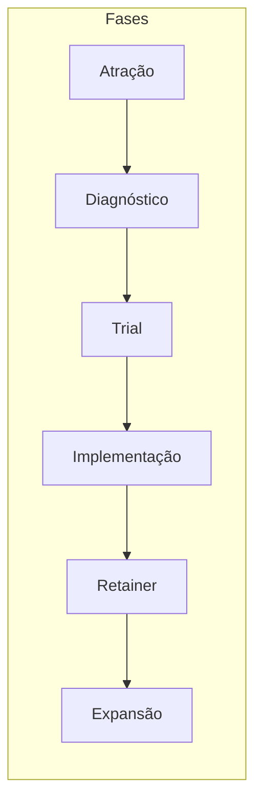
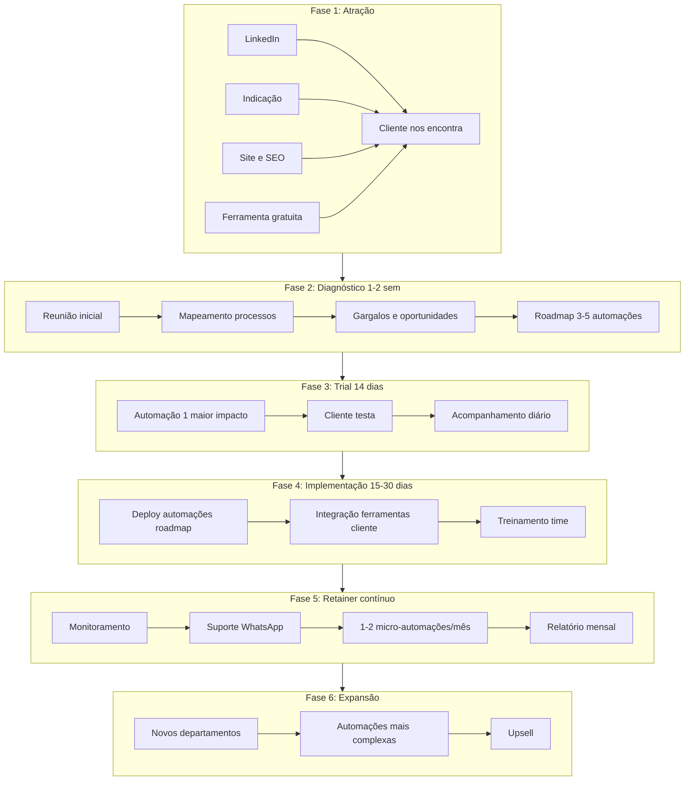
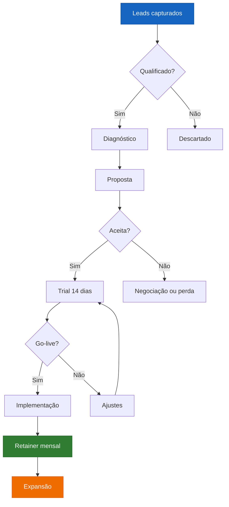
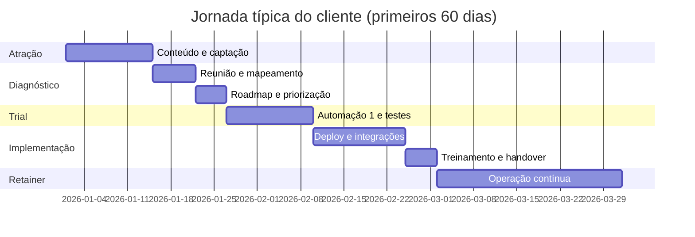
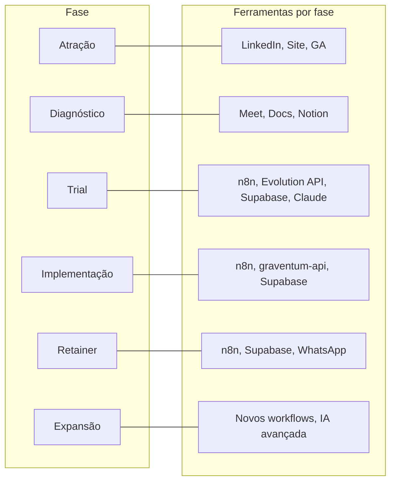
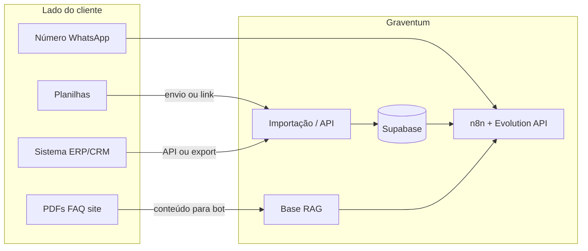

# Jornada do cliente Graventum — Fluxogramas e diagramas

**Tipo:** Relatório com fluxogramas e diagramas  
**Base:** Identidade Graventum, ciclo de vida do projeto, fluxograma de processos executivos.  
**Fonte:** [outputs/reports/2026-02-12-identidade-graventum.md](.openclaw/workspace/outputs/reports/2026-02-12-identidade-graventum.md), [outputs/diagramas/fluxograma-processos-executivos.md](.openclaw/workspace/outputs/diagramas/fluxograma-processos-executivos.md), [processes/ciclo-vida-projeto-graventum.md](.openclaw/workspace/docs-repo-https/processes/ciclo-vida-projeto-graventum.md).

---

## 1. Visão geral da jornada

A jornada do cliente segue seis fases em sequência:

**ATRAÇÃO → DIAGNÓSTICO → TRIAL → IMPLEMENTAÇÃO → RETAINER → EXPANSÃO**

Alternativa operacional (com qualificação e proposta explícitas):

**LEAD → QUALIFICAÇÃO → DIAGNÓSTICO → PROPOSTA → IMPLEMENTAÇÃO → OPERAÇÃO → EXPANSÃO**

---

## 2. Diagrama 1 — Jornada em sequência (alto nível)




---

## 3. Diagrama 2 — Fluxo detalhado por fase (com entradas e saídas)




---

## 4. Diagrama 3 — Funnel comercial (do lead à conversão)




---

## 5. Diagrama 4 — Atividades por fase (timeline)




---

## 6. Diagrama 5 — Stack e responsável por fase




### 6.1 Como funciona a implementação na prática (origem dos dados e acesso)

O Diagrama 5 mostra *quais* ferramentas entram em cada fase; abaixo fica claro **de onde vêm os dados** e **o que o cliente precisa dar** para cada tipo de entrega.

#### De onde vêm os dados?


| Cenário                                           | Quem alimenta o quê                                     | Como                                                                                                                                                                                                                                                                                              |
| ------------------------------------------------- | ------------------------------------------------------- | ------------------------------------------------------------------------------------------------------------------------------------------------------------------------------------------------------------------------------------------------------------------------------------------------- |
| **Planilhas (lista de clientes, produtos, etc.)** | Cliente envia arquivos (Google Sheet, Excel, CSV).      | Graventum importa para o DB (Supabase) no onboarding ou em atualizações combinadas (ex.: 1x por mês). Pode haver um processo manual (você baixa e roda script) ou, se o cliente tiver API/integração, ingestão automática.                                                                        |
| **Cliente “alimenta” o seu DB**                   | Dados ficam no sistema do cliente (ERP, CRM, planilha). | **Opção A:** Cliente exporta e manda; você coloca no DB. **Opção B:** Integração (webhook, API, Zapier/Make) do sistema do cliente para o seu Supabase/n8n. **Opção C:** Acesso read-only a uma planilha Google/Excel; n8n lê direto (sem cópia no seu DB) quando fizer sentido.                  |
| **Bot WhatsApp com IA (respostas inteligentes)**  | Precisa de base de conhecimento.                        | **RAG:** Cliente fornece o conteúdo (PDFs, FAQ, docs, site) que o bot deve usar. Você monta o RAG (embeddings + vetores no Supabase ou ferramenta de RAG). O cliente **não** precisa te dar “acesso a tudo”; só o que for **relevante para o bot** (ex.: manual do produto, políticas, catálogo). |
| **WhatsApp (envio/recebimento)**                  | Número e histórico de conversas.                        | Cliente usa um número (próprio ou novo); Graventum conecta via Evolution API (ou similar). Acesso ao número/instância; histórico pode ser importado ou começar do zero.                                                                                                                           |


#### O cliente precisa me dar acesso a tudo?

**Não.** Só ao que for **necessário para cada automação**:

- **Bot WhatsApp + RAG:** conteúdo (arquivos/links) para a base de conhecimento; acesso ao número/WhatsApp.
- **Automação com planilha:** acesso à planilha (view ou edit, conforme combinado) ou envio periódico do arquivo.
- **Email/Drive:** permissão OAuth ou pasta específica; não “todo o Drive”.
- **ERP/CRM:** idealmente API ou webhook; se não tiver, exportação combinada (ex.: CSV semanal) que você importa no DB.

Resumo: **acesso mínimo por entrega** — definido no diagnóstico e no contrato (o que você pode acessar e por quanto tempo).

#### Fluxo resumido: dados entrando na stack




- **Planilhas / sistema:** entram via importação (manual ou script) ou integração → ficam no **seu** DB (Supabase) e o n8n consome dali (ou lê direto da planilha, se for o desenho).
- **Bot WhatsApp:** usa **RAG** com o que o cliente ceder (documentos, FAQ); o cliente não precisa abrir “tudo”, só o necessário para o bot responder bem.

---

## 7. Resumo das fases (tabela)


| Fase                 | Duração     | Entregável principal                                         | Ferramentas principais                              |
| -------------------- | ----------- | ------------------------------------------------------------ | --------------------------------------------------- |
| **1. Atração**       | Contínuo    | Cliente nos encontra                                         | LinkedIn, Instagram, site, SEO, ferramenta gratuita |
| **2. Diagnóstico**   | 1–2 semanas | Roadmap com 3–5 automações priorizadas                       | Google Meet, Docs, Notion                           |
| **3. Trial**         | 14 dias     | Automação #1 em produção, cliente testando                   | n8n, Evolution API, Supabase, Claude                |
| **4. Implementação** | 15–30 dias  | Todas as automações do roadmap + treinamento                 | n8n, graventum-api, Supabase, Evolution API         |
| **5. Retainer**      | Contínuo    | Operação estável, 1–2 novas automações/mês, relatório mensal | n8n, Supabase, WhatsApp (suporte)                   |
| **6. Expansão**      | Contínuo    | Novos departamentos, automações mais complexas, upsell       | Stack ampliada conforme escopo                      |


---

## 8. Fluxograma em ASCII (alternativa sem Mermaid)

Para uso em documentos que não renderizam Mermaid:

```
┌─────────────┐     ┌─────────────┐     ┌─────────────┐
│  ATRAÇÃO    │────▶│ DIAGNÓSTICO │────▶│   TRIAL     │
│ (cliente    │     │ 1-2 sem     │     │ 14 dias     │
│  nos acha)  │     │ roadmap     │     │ automação 1 │
└─────────────┘     └─────────────┘     └──────┬──────┘
                                               │
                    ┌─────────────┐            │
                    │ EXPANSÃO    │◀───────────┤
                    │ upsell      │            │
                    └──────▲──────┘            │
                           │                   ▼
                    ┌──────┴──────┐     ┌─────────────┐
                    │  RETAINER   │◀────│IMPLEMENTAÇÃO│
                    │ mensal      │     │ 15-30 dias  │
                    │ suporte     │     │ deploy full │
                    └─────────────┘     └─────────────┘
```

---

## 9. Referências

- Identidade e jornada: [outputs/reports/2026-02-12-identidade-graventum.md](.openclaw/workspace/outputs/reports/2026-02-12-identidade-graventum.md)
- Fluxograma processos: [outputs/diagramas/fluxograma-processos-executivos.md](.openclaw/workspace/outputs/diagramas/fluxograma-processos-executivos.md)
- Ciclo de vida: [docs-repo-https/processes/ciclo-vida-projeto-graventum.md](.openclaw/workspace/docs-repo-https/processes/ciclo-vida-projeto-graventum.md)

