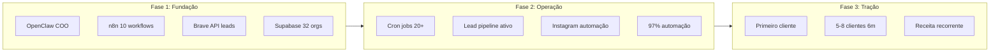

# Análise Completa: Graventum vs Ecossistema Ralph Wiggum / Clawdbot / n8n

## 1. O que seu amigo descreveu (mapeamento)

| Conceito | O que é (real) | O que seu amigo disse |
|----------|----------------|------------------------|
| **Ralph Wiggum** | Framework de loop autônomo para **código** — IA que itera em tarefas de programação até conclusão, com reset de contexto entre iterações. Ferramentas: `ralph` CLI, ralph-loop-agent (Vercel). Casos: refatoração, testes, migração, debugging. | "Automação que auto-aprimora código, rodando 3 IAs em looping" |
| **Clawdbot / Moltbot** | Open-source, assistente pessoal tipo "Jarvis" — Claude com capacidade de execução (browser, terminal, arquivos). Roda em Mac, Windows, Raspberry Pi, Docker. 193k+ stars GitHub. Rebranded para Moltbot. | "Jarvis pro seu PC ou servidor" |
| **n8n** | Plataforma de automação de workflows (low-code). Self-hosted ou cloud. Integrações com 400+ serviços. | Automação de processos |

**Correção importante:** O nome correto é **Ralph Wiggum** (personagem dos Simpsons). Na Graventum foi usado "Ralph Wiggun" como variação.

---

## 2. Similaridade: Graventum vs ecossistema descrito

### 2.1 Clawdbot = OpenClaw (Graventum já tem)

**OpenClaw** é o mesmo projeto que Clawdbot/Moltbot ([github.com/moltbot/clawdbot](https://github.com/moltbot/clawdbot)). A Graventum já opera com:

- **Helix** (COO virtual) = instância do OpenClaw configurada como copilot empresarial
- Acesso a: web_search, browser, exec, cron, n8n via webhook
- Workspace em [`/root/.openclaw/workspace`](/root/.openclaw/workspace)
- Integração documentada em [AGENTS.md](/root/.openclaw/workspace/AGENTS.md) e [platform-status.json](/root/.openclaw/workspace/memory/platform-status.json)

**Conclusão:** O "Jarvis" do PC/servidor já está implementado.

### 2.2 n8n (Graventum já tem)

- **URL:** automation.graventum.com
- **Escala:** 10 workflows, 71 nodes
- **Integração:** OpenClaw aciona via `./tools/n8n-trigger.sh lead-hunt`
- **Status:** `integrated_with_openclaw: true` em [platform-status.json](/root/.openclaw/workspace/memory/platform-status.json)

Workflows incluem: marketing, campanhas, automação fantasma (contabilidade), prospecção.

### 2.3 Ralph Wiggum — dois significados

| Versão | O que é | Graventum tem? |
|--------|---------|----------------|
| **Ralph Wiggum (original)** | Loop autônomo de **código** — IA itera em tarefas de dev até conclusão | **Não** |
| **Ralph Wiggun (Graventum)** | Filosofia + workflow de **automação de negócio** — "automatize tudo repetitivo" | **Sim** (conceito em [n8n-workflows-analysis.md](/root/.openclaw/workspace/docs-repo-https/analysis/n8n-workflows-analysis.md), workflow em [ralph-wiggun-prospecting.json](/root/.openclaw/workspace/outputs/workflows/ralph-wiggun-prospecting.json)) |

O "Ralph Wiggun" da Graventum é uma **personificação da automação total** no contexto de negócio, não o loop técnico de código do Ralph Wiggum original.

---

## 3. Curva de amadurecimento da Graventum

**Estado atual (fev/2026):**

- **Infraestrutura:** Alta maturidade — OpenClaw + n8n + Brave API + Supabase
- **Automação:** ~97% segundo [platform-status.json](/root/.openclaw/workspace/memory/platform-status.json)
- **Leads:** Pipeline ativo (47 leads no primeiro cron, 5 no Supabase)
- **Gap:** Pré-receita — busca primeiro cliente pagante

**Segmento:** Contabilidade, imobiliárias, clínicas, turismo — alinhado ao que seu amigo descreveu.

---

## 4. Ralph Wiggum (original): necessário ou não?

### 4.1 O que o Ralph Wiggum original faz

- Loop autônomo para **desenvolvedores**
- Refatoração, testes, migração, debugging
- Contexto reset entre iterações para evitar degradação
- Foco em **código**, não em processos de negócio

### 4.2 Fit com o negócio da Graventum

| Critério | Avaliação |
|----------|-----------|
| **Core business** | Automação para PMEs (contabilidade, imobiliárias, etc.), não venda de software |
| **Produto** | Workflows n8n, diagnósticos, retainer mensal |
| **Uso interno** | Poderia acelerar desenvolvimento de graventum-api, dashboards, scripts |
| **Prioridade** | Baixa — primeiro cliente e operação são mais urgentes |

### 4.3 Recomendação

**Não é necessário** para o core business atual. O "Ralph Wiggun" que vocês usam (filosofia + workflow de prospecção) já cobre o conceito de automação total no contexto de negócio.

**Considerar no futuro** se:
- A equipe técnica crescer e precisar de mais produtividade em código
- Surgir produto de software próprio (ex.: SaaS de automação)
- Houver demanda explícita de clientes por "auto-aprimoramento de código"

---

## 5. "3 IAs em looping" — interpretação

Possíveis significados:

1. **Ralph Wiggum original:** 1 IA em loop com reset de contexto (não 3)
2. **Multi-agent:** 3 IAs especializadas (ex.: analista, escritor, revisor) em orquestração — conceito já documentado em [exemplos-workflows-n8n-avancados.md](/root/.openclaw/workspace/outputs/exemplos-workflows-n8n-avancados.md)
3. **Interpretação do amigo:** Pode ser uma simplificação ou confusão entre Ralph Wiggum e multi-agent

A Graventum já tem base para multi-agent via n8n + OpenClaw, mas não está implementado como "3 IAs em looping" dedicado.

---

## 6. Análise de negócio consolidada

### 6.1 Posicionamento competitivo

A Graventum está **à frente** em relação ao ecossistema descrito:

- **Clawdbot/Jarvis:** Implementado (OpenClaw/Helix)
- **n8n:** Em uso com 10 workflows
- **Filosofia Ralph Wiggun:** Adotada como princípio de automação
- **Stack:** Claude, Supabase, Brave API, Evolution API (instalada)

### 6.2 Gaps prioritários (não-Ralph)

1. **Primeiro cliente pagante** — foco principal
2. **Webhook lead-hunt** — workflow pode retornar 404 se não estiver ativo no n8n
3. **LinkedIn** — `web_access_validated: false`, prospecção manual
4. **WhatsApp** — Evolution API instalada mas não em uso ativo

### 6.3 Matriz de decisão

| Ação | Impacto | Esforço | Recomendação |
|------|---------|---------|--------------|
| Implementar Ralph Wiggum (original) | Baixo para core business | Médio | **Adiar** |
| Validar/ativar webhook lead-hunt | Alto | Baixo | **Fazer** |
| Consolidar "Ralph Wiggun" como marca interna | Médio (clareza) | Baixo | **Fazer** |
| Multi-agent (3 IAs) para casos específicos | Médio | Alto | **Avaliar** após tração |

---

## 7. Documento de saída sugerido

Criar relatório em [`docs-repo-https/analysis/analise-ecossistema-ralph-clawdbot-n8n.md`](/root/.openclaw/workspace/docs-repo-https/analysis/analise-ecossistema-ralph-clawdbot-n8n.md) com:

- Resumo executivo (1 página)
- Mapeamento conceitual (Ralph Wiggum vs Ralph Wiggun)
- Status Graventum vs ecossistema
- Curva de amadurecimento
- Recomendações priorizadas
- Referências (ralphwiggum.org, clawdbot, n8n)

---

## Resumo final

- **Clawdbot:** Já é o OpenClaw/Helix da Graventum.
- **n8n:** Já está em uso e integrado.
- **Ralph Wiggum (original):** Não é necessário para o core business; o "Ralph Wiggun" interno já cobre a filosofia de automação.
- **Curva de amadurecimento:** Infraestrutura e automação maduras; foco deve ser tração (primeiro cliente) e ajustes operacionais (webhooks, LinkedIn, WhatsApp).
