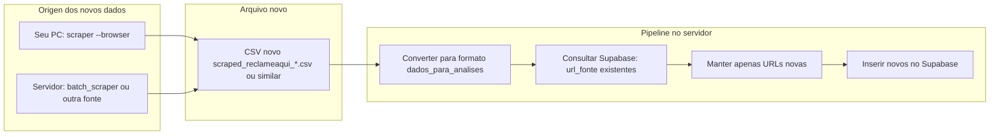

# Plano: Busca por novos dados

## Objetivo

Permitir que **novos dados** de reclamações/dores entrem no sistema sem duplicar o que já existe: buscar (scraping ou CSV novo), deduplicar por `url_fonte` e inserir só o que ainda não está no Supabase.

## Situação atual

- **Fonte ao vivo Reclame Aqui:** [tools/reclameaqui_scraper.py](tools/reclameaqui_scraper.py) com `--browser` funciona no **seu PC** (IP residencial); no servidor o site retorna 403.
- **Carga atual:** [tools/carregar-dados-para-analises-supabase.py](tools/carregar-dados-para-analises-supabase.py) lê um CSV fixo (`5000-linhas...` ou `dados-para-analises.csv`), dedupe por `url_fonte` **dentro do arquivo**, e envia **todos** os registros para o Supabase. Não há consulta ao banco para evitar duplicar com o que já está lá.
- **Supabase:** Tabela [outputs/supabase/dados_para_analises_table.sql](outputs/supabase/dados_para_analises_table.sql) com `UNIQUE(url_fonte)`; inserir URL repetida gera erro.

## Fluxo desejado

## Implementação proposta

### 1. Script de “carga incremental” (só novos)

Criar um script (ex.: `tools/carregar-novos-dados-supabase.py`) que:

- **Entrada:** Caminho de um CSV de reclamações (formato `scraped_reclameaqui_*` ou compatível: `url`, `niche`, `company`, `title`, `text`, `date`, `gravity`).
- **Conversão:** Mapear para o formato da tabela `dados_para_analises`:  
`nicho`, `sistema_software` = company, `empresa_reclamada` = company, `tipo_problema` = primeiros termos do title ou vazio, `descricao_problema` = text, `impacto_negocio` = vazio ou fixo, `data_reclamacao`, `url_fonte` = url, `gravidade`.
- **Dedupe:**  
  - Chamar Supabase para obter a lista de `url_fonte` já existentes (ex.: `GET /rest/v1/dados_para_analises?select=url_fonte` com paginação se necessário).  
  - Filtrar as linhas do CSV cuja `url_fonte` não está nessa lista.
- **Carga:** Enviar apenas essas linhas novas via POST para `dados_para_analises` (em lotes), usando as credenciais do `.env` como no script atual.

Dependências: mesmo `.env` (SUPABASE_URL, SUPABASE_SERVICE_ROLE_KEY) e tabela já criada.

### 2. Onde os “novos dados” entram

- **Cenário A – Reclame Aqui no seu PC:**  
Você roda no seu computador:  
`python3 tools/reclameaqui_scraper.py --niche contabilidade --max-pages 5 --browser`  
Isso gera um CSV (ex.: `scraped_reclameaqui_YYYY-MM-DD.csv`). Você copia esse arquivo para o servidor (ex.: em `outputs/datasets/` ou pasta combinada) e no servidor roda o script de carga incremental passando esse arquivo.
- **Cenário B – Outras fontes no servidor:**  
[tools/batch_scraper.py](tools/batch_scraper.py) ou [tools/research_scraper.py](tools/research_scraper.py) geram conteúdo de outros sites. Se for criado um CSV no formato esperado (com coluna `url` ou `url_fonte`), o mesmo script de carga incremental pode ser usado para inserir só os novos.

### 3. Documentação e uso pelo Helix

- **Doc:** Atualizar [docs/SCRAPING_PESQUISA_CONTEXTO.md](docs/SCRAPING_PESQUISA_CONTEXTO.md) (ou README dos datasets) com:
  - “Busca por novos dados”: (1) Gerar CSV novo (scraper no PC ou batch no servidor); (2) Copiar para o workspace se vier do PC; (3) Rodar `carregar-novos-dados-supabase.py <caminho_do_csv>` para inserir apenas registros cuja `url_fonte` ainda não existe no Supabase.
- **Prompt para o Helix:** Incluir no guia que você usa para o Helix algo como: “Quando eu colocar um CSV novo de reclamações em `outputs/datasets/` (ex.: scraped_reclameaqui_*.csv), roda o script de carga incremental para enviar só os registros novos para a tabela `dados_para_analises` no Supabase.”

### 4. Resumo de arquivos

| Ação        | Arquivo / lugar                                                                                                                                          |
| ----------- | -------------------------------------------------------------------------------------------------------------------------------------------------------- |
| Novo script | `tools/carregar-novos-dados-supabase.py` (conversão scraped -> dados_para_analises, consulta url_fonte no Supabase, filtro, POST em lotes)               |
| Doc         | `docs/SCRAPING_PESQUISA_CONTEXTO.md` ou `outputs/datasets/DADOS_PARA_ANALISES_README.md`: seção “Busca por novos dados”                                  |
| Sem mudança | `reclameaqui_scraper.py`, `dados_para_analises_table.sql`; opcional: `carregar-dados-para-analises-supabase.py` continua para carga em massa do CSV base |

Assim, a “busca por novos dados” fica clara: novos dados vêm do scraper (ou de outro CSV); um único script no servidor garante que só entram registros com `url_fonte` ainda inexistente no Supabase.