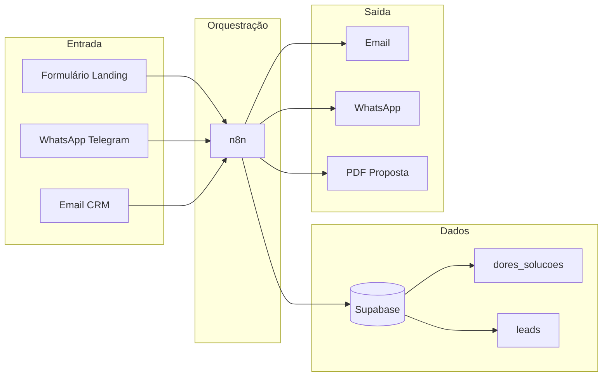
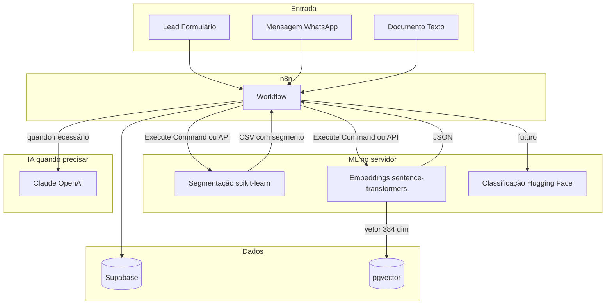
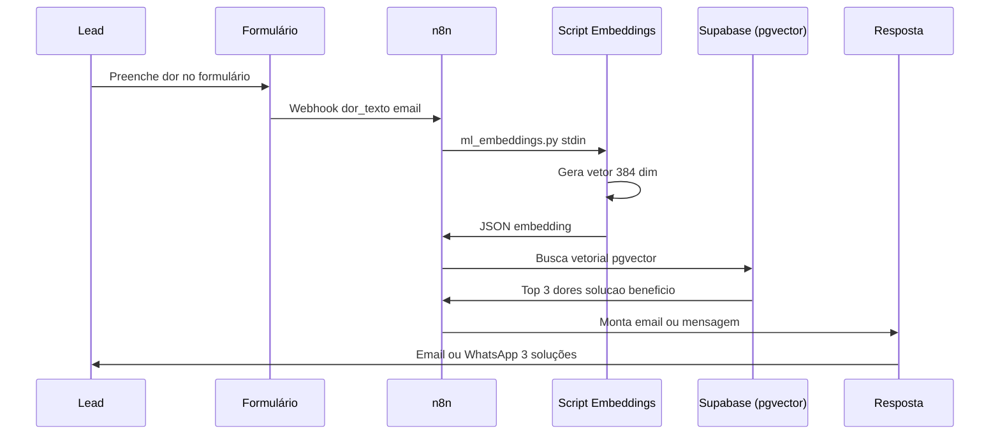
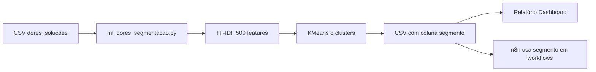
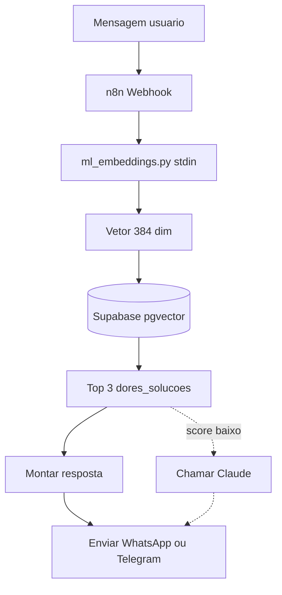
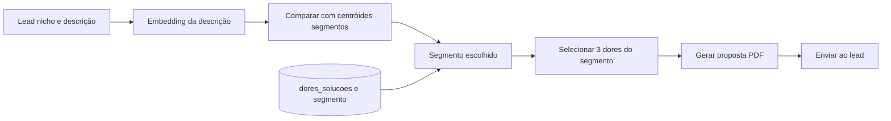
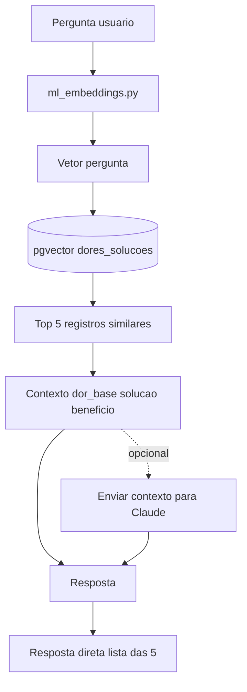

# ML — Casos de uso, fluxogramas e benefícios (guia visual e aplicado)

Como especialista em integração de sistemas e aprendizado de máquina, este documento descreve a **pipeline atual** (visual e textual), a **análise de onde a IA se insere** no processo e **cinco casos de uso** com fluxogramas e passo a passo, permitindo compreensão completa das interações propostas.

---

## 1. Pipeline atual (visual)

### 1.1 Fluxograma da trajetória dos dados

Entrada (formulário, WhatsApp, CRM) → n8n → Supabase (dores_solucoes, leads) → saída (email, WhatsApp, PDF).

### 1.2 Descrição textual detalhada do que já existe

**Funcionamento de cada componente**

- **Entrada — Formulário/Landing:** lead preenche campos (tipo de negócio, dor, email); dados vão ao n8n via webhook ou integração (Typeform, Google Forms).
- **Entrada — WhatsApp/Telegram:** mensagens via API disparam workflows; payload traz texto, id do usuário e metadados.
- **Entrada — Email/CRM:** novos leads ou eventos acionam n8n por webhook, polling ou schedule.
- **Orquestração (n8n):** workflows com nós trigger, HTTP Request, Code, Execute Command; lê/grava Supabase, executa scripts, chama APIs (Claude, OpenAI). Hoje não há etapa de ML obrigatória; inteligência = filtro por nicho/tema ou IA externa.
- **Dados (Supabase):** tabela `dores_solucoes` e tabelas como `leads`. Sem coluna embedding nem pgvector na pipeline padrão; busca por igualdade ou filtro em texto.
- **Saída:** n8n envia email, WhatsApp/Telegram ou gera PDF/proposta com trechos de dores e soluções.

Hoje, a “inteligência” costuma ser: filtro por `nicho`/`tema` (ex.: GET dores_solucoes WHERE nicho = Contabilidade) ou uso de IA externa (OpenAI/Claude) para texto. **Não há** busca por similaridade de texto nem segmentação automática das dores no servidor.

---

## 2. Integração do ML (visão integrada)

Diagrama que ilustra como o **n8n** interage com as etapas de **segmentação**, **embeddings** e (futuro) **classificação**, como os embeddings alimentam o **pgvector** e quando o **Claude** deve ser acionado. O ML encaixa entre orquestração e dados; não substitui n8n nem Supabase.

**Papel de cada caixa ML:**

- **Segmentação (scikit-learn):** agrupa dores/soluções por similaridade de texto; gera CSV com coluna `segmento`. O n8n pode usar isso para “qual segmento esse lead pertence?” ou para relatórios.
- **Embeddings (sentence-transformers):** transforma texto em vetor; o vetor vai para o **pgvector** (Supabase) e permite **busca semântica** (“achando dores parecidas com o que o lead disse”) sem depender só de filtro exato de nicho.
- **Classificação (Hugging Face):** uso futuro (ex.: classificar mensagem em nicho/tema, sentimento); pode rodar no servidor e só depois o n8n decidir se chama Claude ou não.

Assim, a pipeline **continua** sendo: entrada → n8n → dados; o ML **enriquece** os dados e as decisões antes de gastar com IA externa.

**Quando acionar o Claude:** Não acionar quando a busca vetorial ou o segmento já devolverem resultados com similaridade alta (ex.: score > 0,7)—monta resposta com as linhas e envia. Acionar quando a similaridade for baixa, quando a pergunta exigir resposta em prosa ou quando for necessário refinar ou gerar texto; o n8n envia contexto ao Claude e devolve a resposta. O ML reduz chamadas à IA externa.

---

## 3. Cinco casos de uso (fluxograma e passo a passo por caso)

Cada caso abaixo é um cenário real: quem faz o quê, em que ordem, e onde o ML aparece.

---

### Caso 1 — Lead preenche “minha dor” no formulário → resposta personalizada com busca semântica

**Cenário:** Um contador acessa sua landing e escreve: “Demoro muito na conciliação bancária e erro no fechamento”. Hoje você poderia só filtrar por nicho “Contabilidade”. Com ML, você **converte a frase em vetor**, busca no Supabase (pgvector) as dores **mais parecidas** e devolve as soluções certas.

**Fluxograma:**

**Passo a passo (operacional):**

1. Formulário envia para o n8n: `dor_texto`, `email`, opcional `nicho`.
2. n8n — Execute Command:
  `echo "{{ $json.dor_texto }}" | /root/.openclaw/workspace/.venv/bin/python3 /root/.openclaw/workspace/tools/ml_embeddings.py --stdin`  
   Saída: JSON com um único `embedding` (lista de 384 números).
3. n8n — HTTP Request para Supabase:
  POST para função RPC ou query que faz `match_dores_by_embedding(embedding, limit => 3)` (ex.: extensão pgvector).
4. n8n — Monta o texto da resposta com `solucao_graventum`, `beneficio_esperado`, `impacto_financeiro` das 3 linhas retornadas.
5. n8n — Envia email ou WhatsApp para o lead.

**O que tem no plano:** Fluxo definido (formulário → webhook n8n → Execute Command ml_embeddings.py --stdin → Supabase pgvector → montar mensagem → email/WhatsApp). Comando exato e ordem dos nós descritos. Pendente: tabela/coluna embedding no Supabase e função RPC de busca vetorial; implementar workflow no n8n.

**Benefício para o cliente (lead):** Recebe soluções **relevantes para o texto que ele escreveu**, não só “tudo de Contabilidade”. Aumenta conversão e sensação de personalização.

---

### Caso 2 — Enriquecer a base de dores com “segmento” para relatórios e campanhas

**Cenário:** Você tem centenas de linhas em `dores_solucoes`. Quer saber “quantos grupos naturais existem?” (ex.: contabilidade fiscal, contabilidade operacional, imobiliária gestão, etc.) para relatórios internos ou campanhas por segmento. O script de **segmentação** (TF-IDF + KMeans) faz isso no servidor.

**Fluxograma:**

**Passo a passo:**

1. Você roda (uma vez ou agendado):
  `.venv/bin/python3 tools/ml_dores_segmentacao.py --csv outputs/datasets/consolidated_dores_solucoes.csv --out outputs/datasets/dores_com_segmento.csv --clusters 8`
2. O script adiciona a coluna `segmento` (0 a 7). Cada número é um “grupo” de dores parecidas (por texto).
3. Você pode:
  - Carregar esse CSV no Supabase (coluna extra na tabela ou tabela derivada).  
  - Usar no n8n: “para cada segmento, buscar leads que casam com dores desse segmento” ou “gerar relatório por segmento”.
4. Opcional: agendar no n8n (Schedule) para rodar o script e atualizar o CSV/banco periodicamente.

**Benefício:** Você passa a falar em “segmento 3” ou “segmento 5” em reuniões e campanhas, sem depender de alguém classificando à mão. O poder computacional (CPU, alguns segundos) está no seu servidor.

**O que tem no plano:** Script ml_dores_segmentacao.py implementado e testado; parâmetros e comando documentados. Saída dores_com_segmento.csv existente. Uso no n8n (agendar ou chamar script) e carregar segmento no Supabase definidos.

---

### Caso 3 — Bot “Qual é a sua dor?” com resposta por similaridade (sem IA paga por mensagem)

**Cenário:** No WhatsApp ou Telegram, o usuário manda: “não consigo fechar o caixa no prazo”. O bot deve devolver 2–3 soluções da base. Em vez de chamar Claude em toda mensagem, você usa **embedding** da frase → busca no pgvector → monta resposta com as linhas retornadas. Claude pode ser chamado só para mensagens que não casaram bem ou para refinar o texto.

**Fluxograma:**

**Passo a passo:**

1. n8n recebe a mensagem (webhook do canal).
2. Execute Command: texto da mensagem → `ml_embeddings.py --stdin` → JSON com `embedding`.
3. n8n chama Supabase (RPC ou query pgvector) com esse vetor, `limit 3`.
4. Se a similaridade do top 1 for acima de um limiar (ex.: 0,7), monta a resposta só com as 3 linhas (solucao_graventum, beneficio_esperado) e envia.
5. Se for abaixo, opcionalmente envia para Claude (“o usuário disse X; sugira uma resposta ou busque em dores_solucoes”) e depois envia.

**Benefício para o cliente final:** Resposta rápida e barata na maioria dos casos; IA cara só quando realmente precisar. Para você: menos custo por conversa.

**O que tem no plano:** Fluxo definido (webhook → ml_embeddings.py --stdin → pgvector → top 3 → montar resposta → enviar; opcional Claude se score baixo). Comando Execute Command e critério de “score baixo” para acionar Claude descritos. Pendente: tabela com embedding no Supabase; implementar workflow no n8n e conectar ao canal WhatsApp/Telegram.

---

### Caso 4 — Proposta comercial com dores do “mesmo segmento” do lead

**Cenário:** O lead já está qualificado (nicho: Imobiliária). Em vez de pegar “3 dores quaisquer de Imobiliária”, você quer “3 dores do **segmento** que mais combina com o perfil desse lead” (ex.: segmento focado em gestão de inquilinos). Você já tem `dores_com_segmento.csv`; no Supabase pode ter coluna `segmento` ou tabela auxiliar.

**Fluxograma:**

**Passo a passo (resumido):**

1. Lead tem `nicho` e opcionalmente um texto livre (descrição do negócio).
2. Se houver texto: gera embedding → compara com “centróide” de cada segmento (ou busca no pgvector por segmento) e escolhe o segmento.
3. Consulta Supabase: `dores_solucoes WHERE nicho = {nicho} AND segmento = {segmento} LIMIT 3`.
4. Monta proposta (template) com essas 3 dores e gera PDF; envia por email.

**Benefício:** Proposta mais relevante para o perfil do lead, sem trabalho manual de escolher “quais dores” colocar.

**O que tem no plano:** Cenário e fluxo descritos (lead nicho + descrição → segmento → Supabase WHERE nicho AND segmento → 3 dores → PDF → email). Depende da coluna segmento no Supabase. Passo a passo resumido definido; implementação n8n e template de proposta pendentes.

---

### Caso 5 — RAG “interno”: perguntas sobre a base de dores (para sua equipe ou para um bot)

**Cenário:** Alguém pergunta: “Quais soluções temos para conciliação bancária?”. Em vez de só buscar a palavra “conciliação” no texto, você usa **embeddings**: a pergunta vira vetor, busca no pgvector as dores/soluções mais próximas e devolve (ou passa esse contexto para Claude para gerar uma resposta em prosa).

**Fluxograma:**

**Benefício:** Um “assistente” que conhece toda a base de dores/soluções usando o poder de busca semântica no seu servidor; Claude entra só se quiser resposta em linguagem natural elaborada.

**O que tem no plano:** Fluxo definido (pergunta → ml_embeddings.py → vetor → pgvector → top 5 → contexto; resposta direta ou contexto para Claude). Diagrama e benefício descritos. Pendente: tabela/coluna embedding no Supabase; interface (chat ou nó n8n) para pergunta e resposta.

---

## 4. Poder computacional que está sendo construído (o que cada peça faz)

Visão objetiva do que o servidor passa a fazer **sozinho**, sem depender de API externa para esses passos.

| Recurso                                | O que faz                                                             | Onde roda                          | Limite prático (hoje)                                                              |
| -------------------------------------- | --------------------------------------------------------------------- | ---------------------------------- | ---------------------------------------------------------------------------------- |
| **Segmentação (TF-IDF + KMeans)**      | Agrupa textos (dores + soluções) em K grupos por similaridade.        | Script Python no servidor (CPU).   | Centenas a milhares de linhas em segundos. 8 clusters default; pode aumentar.      |
| **Embeddings (sentence-transformers)** | Transforma uma frase ou um CSV de frases em vetores de 384 dimensões. | Script Python no servidor (CPU).   | Modelo multilingue (PT); batch de 32; centenas de linhas em poucos minutos.        |
| **Supabase + pgvector**                | Armazena vetores e faz busca por similaridade (cosine ou L2).         | Supabase (cloud).                  | Depende do plano; milhares de vetores são viáveis.                                 |
| **Hugging Face (transformers)**        | Classificação, NER, sumarização quando você implementar.              | Script Python no servidor (CPU).   | Modelos pequenos (distilbert etc.); tempo por item maior que embeddings.           |
| **TensorFlow / JAX**                   | Treino ou inferência de modelos customizados (futuro).                | Servidor (CPU) ou máquina com GPU. | Hoje instalado; uso ainda em cenários específicos (ex.: modelo treinado por você). |

**Em uma frase:** você ganha **segmentação em lote** e **busca semântica (embeddings + pgvector)** no seu próprio ambiente; isso reduz chamadas a APIs de embedding (OpenAI, etc.) e permite fluxos que hoje seriam inviáveis ou caros.

---

## 5. Benefícios para futuros clientes (por tipo de entrega)

Não só “o que a ferramenta faz”, mas **o que o cliente final sente** quando você usa isso na entrega.

| Tipo de cliente / entrega               | Benefício concreto                                                                                                                                                                       |
| --------------------------------------- | ---------------------------------------------------------------------------------------------------------------------------------------------------------------------------------------- |
| **PME (qualquer nicho)**                | Resposta rápida e personalizada quando descreve a dor (formulário ou chat), sem depender de “escolher categoria” no dropdown.                                                            |
| **Contabilidade / escritórios**         | Propostas e conteúdos alinhados ao “tipo” de dor (fiscal, operacional, conciliação, etc.) porque você segmentou a base e usa segmento na hora de buscar.                                 |
| **Imobiliárias**                        | Mesma lógica: segmentos (gestão de inquilinos, captação, compliance) permitem mensagens e propostas mais relevantes.                                                                     |
| **Você (Graventum) internamente**       | Relatórios por segmento (“quantos leads no segmento 3?”), campanhas por segmento, e um “cérebro” de busca semântica sobre a base sem custo por consulta.                                 |
| **Cliente que contrata automação + IA** | Bot ou assistente que “entende” a base de dores/soluções (RAG) com custo menor porque embeddings e busca rodam no seu servidor; Claude entra só quando a resposta precisa ser mais rica. |

---

## 6. Aplicação em casos reais (resumo em tabela)

| Cenário real                           | Entrada                           | O que o ML faz                                              | Saída                                                            | Integração na pipeline                                                                    |
| -------------------------------------- | --------------------------------- | ----------------------------------------------------------- | ---------------------------------------------------------------- | ----------------------------------------------------------------------------------------- |
| Lead preenche “minha dor” no site      | Texto livre no formulário         | Embedding → busca pgvector                                  | Email/WhatsApp com até 3 soluções mais parecidas                 | n8n webhook → Execute Command (embeddings) → Supabase pgvector → montar mensagem → enviar |
| Relatório “quantos por segmento?”      | CSV dores_solucoes                | Segmentação (KMeans) → CSV com segmento                     | Dashboard ou planilha por segmento                               | Script agendado ou manual → atualizar CSV/banco → n8n ou Metabase consomem                |
| Bot WhatsApp “qual sua dor?”           | Mensagem do usuário               | Embedding → busca pgvector                                  | Resposta com 2–3 soluções                                        | n8n webhook → embeddings → pgvector → template de resposta → API WhatsApp                 |
| Proposta comercial automática          | Lead (nicho + opcional descrição) | Segmento por embedding ou regra; filtrar dores por segmento | PDF com 3 dores-soluções do segmento certo                       | n8n: buscar segmento → Supabase dores_solucoes WHERE segmento → gerar PDF → email         |
| Equipe pergunta “o que temos sobre X?” | Pergunta em texto                 | Embedding da pergunta → busca pgvector                      | Lista de dores/soluções ou resposta gerada (Claude) com contexto | Chat interno ou n8n: embeddings → pgvector → listar ou passar contexto a Claude           |

---

## 7. Próximos passos sugeridos (para tornar isso ainda mais visual e útil)

1. **Criar uma tabela no Supabase com coluna `embedding` (vector(384))** e popular com o script de embeddings a partir de `dores_solucoes` (uma vez ou periódico). Assim os casos 1, 3 e 5 passam a usar busca vetorial de verdade.
2. **Implementar no n8n** pelo menos um workflow do Caso 1 (formulário → embedding → busca → email) e desenhar o fluxo no próprio n8n (cada nó = uma caixa do diagrama).
3. **Documentar em um “one-pager” por caso de uso** para o comercial: um fluxograma + 3 bullets de benefício para o cliente, para usar em proposta ou apresentação.
4. **Gravar um vídeo curto** (ou roteiro) “do formulário ao email” mostrando tela do n8n + resultado no email; isso torna o poder computacional e a integração muito mais tangíveis.

---

## 8. Referências cruzadas

| Quero...                                                | Onde ver                                                                                               |
| ------------------------------------------------------- | ------------------------------------------------------------------------------------------------------ |
| Comandos e scripts (segmentação, embeddings)            | [ml_servidor_modelos_detalhamento_completo.plan.md](ml_servidor_modelos_detalhamento_completo.plan.md) |
| Ideias de workflows n8n (sem ML)                        | [workflows_n8n_dores_solucoes.plan.md](workflows_n8n_dores_solucoes.plan.md)                           |
| Uso no n8n (Execute Command, parâmetros)                | `docs/ML_PYTORCH_SKLEARN_USO.md`                                                                       |
| Benefícios por biblioteca (scikit-learn, PyTorch, etc.) | `docs/PYTORCH_SCIKIT_LEARN_SERVIDOR.md`                                                                |

