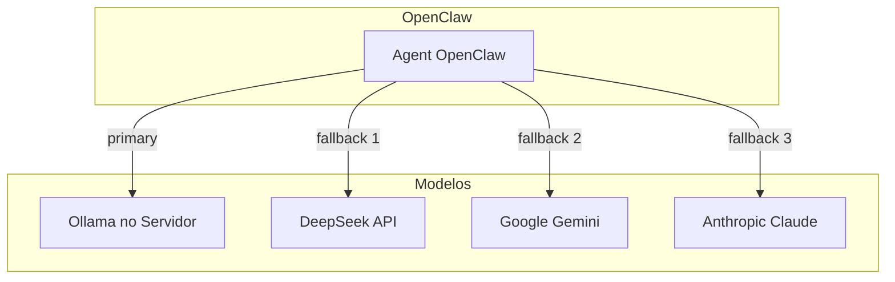

# Plano: Ollama no Servidor + OpenClaw para Redução de Custos de API

## Contexto Atual

Sua configuração em [`~/.openclaw/openclaw.json`](~/.openclaw/openclaw.json) usa:
- **Primary**: DeepSeek (API paga)
- **Fallbacks**: Google Gemini, Anthropic Claude
- **Cron jobs**: lead hunting, dashboards, relatórios diários (alto volume de chamadas)

O OpenClaw já possui **suporte nativo ao Ollama** via API compatível com OpenAI. A documentação oficial está em `docs/providers/ollama.md` no pacote.

---

## Arquitetura Proposta



---

## Fase 1: Deploy do Ollama no Servidor

### Opção A: Bare Metal (recomendado se servidor dedicado)

```bash
# Instalar Ollama
curl -fsSL https://ollama.com/install.sh | sh

# Iniciar como serviço (systemd)
sudo systemctl enable ollama
sudo systemctl start ollama
```

### Opção B: Docker (isolamento, fácil migração)

```yaml
# docker-compose.yml para Ollama
services:
  ollama:
    image: ollama/ollama:latest
    ports:
      - "11434:11434"
    volumes:
      - ollama_data:/root/.ollama
    # Opcional: GPU (descomente se tiver NVIDIA)
    # deploy:
    #   resources:
    #     reservations:
    #       devices:
    #         - driver: nvidia
    #           count: 1
    #           capabilities: [gpu]
volumes:
  ollama_data:
```

### Modelos recomendados por hardware

| Hardware | Modelo sugerido | Uso |
|----------|-----------------|-----|
| 8GB RAM, CPU only | `phi3:mini`, `qwen2.5:3b` | Tarefas leves, cron |
| 16GB RAM | `llama3.2:3b`, `mistral:7b` | Uso geral |
| 32GB RAM ou 12GB+ VRAM | `qwen2.5-coder:14b`, `deepseek-r1:14b` | Coding, reasoning |
| 64GB+ RAM ou 24GB+ VRAM | `qwen2.5-coder:32b`, `deepseek-r1:32b` | Full agent |

```bash
# Exemplos de pull
ollama pull qwen2.5-coder:7b   # Bom para tasks de agent
ollama pull phi3:mini          # Leve, rápido
ollama pull deepseek-r1:14b    # Reasoning (se hardware permitir)
```

---

## Fase 2: Configuração do OpenClaw

### 2.1 Adicionar provider Ollama

Editar [`~/.openclaw/openclaw.json`](~/.openclaw/openclaw.json) — adicionar em `models.providers`:

```json
{
  "models": {
    "providers": {
      "ollama": {
        "baseUrl": "http://127.0.0.1:11434/v1",
        "apiKey": "ollama-local",
        "api": "openai-completions",
        "models": [
          {
            "id": "qwen2.5-coder:7b",
            "name": "Qwen 2.5 Coder 7B",
            "reasoning": false,
            "input": ["text"],
            "cost": { "input": 0, "output": 0, "cacheRead": 0, "cacheWrite": 0 },
            "contextWindow": 32768,
            "maxTokens": 8192
          }
        ]
      },
      "deepseek": { ... }
    }
  }
}
```

**Importante**: `baseUrl` deve terminar com `/v1`.

### 2.2 Se Ollama estiver em outro host

```json
"baseUrl": "http://IP_DO_SERVIDOR:11434/v1"
```

### 2.3 Estratégia de redução de custos

**Opção A – Ollama como primary (máxima economia)**

```json
"agents": {
  "defaults": {
    "model": {
      "primary": "ollama/qwen2.5-coder:7b",
      "fallbacks": ["deepseek/deepseek-chat", "google/gemini-3-flash-preview"]
    }
  }
}
```

**Opção B – Híbrida (Ollama para cron, API para interativo)**

- Manter `primary: "deepseek/deepseek-chat"` para sessões interativas (Telegram, webchat).
- Criar agent específico para cron com `primary: "ollama/..."` em `agents.list[].model` ou via `modelOverrides` nos jobs.

**Opção C – Auto-discovery (mais simples)**

```bash
export OLLAMA_API_KEY="ollama-local"
```

Sem definir `models.providers.ollama` explicitamente. O OpenClaw descobre modelos em `http://127.0.0.1:11434` automaticamente (apenas modelos com suporte a tools).

---

## Fase 3: Cron e Jobs Automatizados

Os jobs em [`~/.openclaw/cron/jobs.json`](~/.openclaw/cron/jobs.json) (lead hunting, dashboard, relatórios) consomem API. Para reduzir custos:

1. **Configurar model override por job** (se suportado por OpenClaw) para usar Ollama.
2. **Ou** criar um agent separado `cron-agent` com `primary: "ollama/..."` e apontar os jobs para esse agent.

---

## Checklist de Implementação

1. [ ] Instalar Ollama no servidor (bare metal ou Docker)
2. [ ] Fazer `ollama pull` de pelo menos um modelo (ex: `qwen2.5-coder:7b`)
3. [ ] Testar: `curl http://127.0.0.1:11434/api/tags`
4. [ ] Adicionar provider `ollama` em `openclaw.json` ou definir `OLLAMA_API_KEY`
5. [ ] Ajustar `agents.defaults.model` para usar `ollama/...` como primary ou fallback
6. [ ] Reiniciar gateway: `openclaw gateway restart`
7. [ ] Validar: `openclaw models list` e `openclaw models status`
8. [ ] Testar fluxo: enviar mensagem no Telegram ou TUI e verificar resposta
9. [ ] (Opcional) Configurar cron jobs para usar Ollama

---

## Considerações

- **Streaming**: O OpenClaw desabilita streaming por padrão para Ollama (evita respostas corrompidas em tool-calls). Respostas são entregues de uma vez.
- **Latência**: Modelos locais podem ser mais lentos que API.
- **Qualidade**: Modelos 7B são bons para tarefas estruturadas; para raciocínio complexo, considere 14B+ ou manter fallback para DeepSeek/Claude.
- **Rede**: Se OpenClaw e Ollama estiverem em containers diferentes, use `host.docker.internal` (Docker Desktop) ou IP do host.

---

## Estimativa de Economia

- **Cron jobs** (lead hunting, dashboard, relatórios): ~100% de economia se migrados para Ollama.
- **Sessões interativas**: depende do uso de fallback; se Ollama atender bem, redução significativa em DeepSeek/Claude/Gemini.
