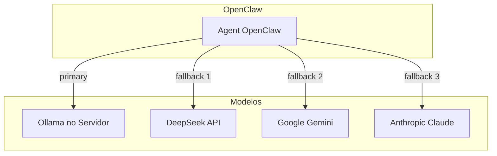

# Plano: Ollama no Servidor + OpenClaw para Redução de Custos de API

## Contexto Atual

Sua configuração em `[~/.openclaw/openclaw.json](~/.openclaw/openclaw.json)` usa:

- **Primary**: DeepSeek (API paga)
- **Fallbacks**: Google Gemini, Anthropic Claude
- **Cron jobs**: lead hunting, dashboards, relatórios diários (alto volume de chamadas)

O OpenClaw já possui **suporte nativo ao Ollama** via API compatível com OpenAI. A documentação oficial está em `docs/providers/ollama.md` no pacote.

---

## Análise do Servidor (atual)


| Recurso   | Valor                              | Impacto                      |
| --------- | ---------------------------------- | ---------------------------- |
| **CPU**   | 4 cores AMD EPYC-Genoa @ 2.0GHz    | Adequado para inferência CPU |
| **RAM**   | 7.6 GB total, ~4 GB disponível     | Principal gargalo            |
| **GPU**   | Nenhuma (Virtio = display virtual) | Inferência 100% em CPU       |
| **Disco** | 150 GB, 133 GB livres              | Suficiente para modelos      |
| **Swap**  | 0                                  | Sem buffer de memória        |


**Processos consumindo RAM**: openclaw-gateway (~~440MB), n8n (~~400MB), VSCode/Cursor (~~1.2GB), graventum-api (~~110MB), dockerd (~90MB). Sobram ~2–3 GB para Ollama em cenário típico.

### Decisão recomendada


| Decisão              | Recomendação                    | Motivo                                                   |
| -------------------- | ------------------------------- | -------------------------------------------------------- |
| **Método de deploy** | **Bare metal**                  | Sem overhead de Docker; menos RAM; instalação direta     |
| **Modelo**           | `**phi3:mini` ou `qwen2.5:3b**` | ~2 GB RAM; cabe no servidor; bom para cron e tasks leves |
| **Evitar**           | Modelos 7B+                     | 7B precisa ~4–5 GB; risco de OOM com 7.6 GB totais       |
| **Swap**             | Adicionar 2–4 GB                | Margem para picos; evita OOM em cargas altas             |


**Estratégia sugerida**: usar Ollama **apenas para cron jobs** (lead hunting, dashboard, relatórios). Manter DeepSeek como primary para sessões interativas (Telegram, webchat), onde a qualidade conta mais. Assim você reduz custos nos jobs automatizados sem comprometer a experiência interativa.

---

## Arquitetura Proposta




---

## Fase 1: Deploy do Ollama no Servidor

### 1.1 Adicionar swap (recomendado para este servidor)

```bash
# Criar arquivo de swap de 2GB
sudo fallocate -l 2G /swapfile
sudo chmod 600 /swapfile
sudo mkswap /swapfile
sudo swapon /swapfile

# Persistir no boot
echo '/swapfile none swap sw 0 0' | sudo tee -a /etc/fstab
```

### 1.2 Instalar Ollama (bare metal — recomendado)

```bash
# Instalar Ollama
curl -fsSL https://ollama.com/install.sh | sh

# Iniciar como serviço (systemd)
sudo systemctl enable ollama
sudo systemctl start ollama
```

**Por que bare metal**: Com 7.6 GB RAM, Docker adiciona overhead. Bare metal usa menos memória e é mais simples.

### 1.3 Pull do modelo (para este servidor: 3B apenas)

```bash
# Modelo recomendado para 7.6 GB RAM
ollama pull phi3:mini
# ou
ollama pull qwen2.5:3b
```

**Não use** `qwen2.5-coder:7b` ou modelos maiores neste servidor — risco de OOM.

### 1.4 Alternativa: Docker (se preferir isolamento)

Use apenas se tiver motivos fortes (ex.: orquestração com outros serviços). Consome mais RAM.

```yaml
services:
  ollama:
    image: ollama/ollama:latest
    ports:
      - "11434:11434"
    volumes:
      - ollama_data:/root/.ollama
volumes:
  ollama_data:
```

---

## Fase 2: Configuração do OpenClaw

### 2.1 Adicionar provider Ollama

Editar `[~/.openclaw/openclaw.json](~/.openclaw/openclaw.json)` — adicionar em `models.providers`:

```json
{
  "models": {
    "providers": {
      "ollama": {
        "baseUrl": "http://127.0.0.1:11434/v1",
        "apiKey": "ollama-local",
        "api": "openai-completions",
        "models": [
          {
            "id": "phi3:mini",
            "name": "Phi-3 Mini",
            "reasoning": false,
            "input": ["text"],
            "cost": { "input": 0, "output": 0, "cacheRead": 0, "cacheWrite": 0 },
            "contextWindow": 4096,
            "maxTokens": 2048
          }
        ]
      },
      "deepseek": { ... }
    }
  }
}
```

**Importante**: `baseUrl` deve terminar com `/v1`.

### 2.2 Se Ollama estiver em outro host

```json
"baseUrl": "http://IP_DO_SERVIDOR:11434/v1"
```

### 2.3 Estratégia de redução de custos

**Recomendado para este servidor – Híbrida (Ollama para cron, API para interativo)**

- Manter `primary: "deepseek/deepseek-chat"` para sessões interativas (Telegram, webchat) — melhor qualidade.
- Configurar cron jobs para usar `ollama/phi3:mini` — economia nos jobs automatizados sem comprometer UX.
- Criar agent específico para cron com `primary: "ollama/phi3:mini"` em `agents.list[].model` ou via `modelOverrides` nos jobs.

**Alternativa – Ollama como primary (máxima economia, qualidade menor)**

```json
"agents": {
  "defaults": {
    "model": {
      "primary": "ollama/phi3:mini",
      "fallbacks": ["deepseek/deepseek-chat", "google/gemini-3-flash-preview"]
    }
  }
}
```

**Opção C – Auto-discovery (mais simples)**

```bash
export OLLAMA_API_KEY="ollama-local"
```

Sem definir `models.providers.ollama` explicitamente. O OpenClaw descobre modelos em `http://127.0.0.1:11434` automaticamente (apenas modelos com suporte a tools).

---

## Fase 3: Cron e Jobs Automatizados

Os jobs em `[~/.openclaw/cron/jobs.json](~/.openclaw/cron/jobs.json)` (lead hunting, dashboard, relatórios) consomem API. Para reduzir custos:

1. **Configurar model override por job** (se suportado por OpenClaw) para usar Ollama.
2. **Ou** criar um agent separado `cron-agent` com `primary: "ollama/..."` e apontar os jobs para esse agent.

---

## Checklist de Implementação

1. [ ] Adicionar swap de 2 GB (recomendado para este servidor)
2. [ ] Instalar Ollama em bare metal: `curl -fsSL https://ollama.com/install.sh | sh`
3. [ ] Fazer `ollama pull phi3:mini` (ou `qwen2.5:3b`)
4. [ ] Testar: `curl http://127.0.0.1:11434/api/tags`
5. [ ] Adicionar provider `ollama` em `openclaw.json` ou definir `OLLAMA_API_KEY`
6. [ ] Configurar cron jobs para usar `ollama/phi3:mini` (manter DeepSeek para interativo)
7. [ ] Reiniciar gateway: `openclaw gateway restart`
8. [ ] Validar: `openclaw models list` e `openclaw models status`
9. [ ] Testar fluxo: cron job + mensagem no Telegram

---

## Considerações

- **Streaming**: O OpenClaw desabilita streaming por padrão para Ollama (evita respostas corrompidas em tool-calls). Respostas são entregues de uma vez.
- **Latência**: Modelos locais podem ser mais lentos que API.
- **Qualidade**: Modelos 7B são bons para tarefas estruturadas; para raciocínio complexo, considere 14B+ ou manter fallback para DeepSeek/Claude.
- **Rede**: Se OpenClaw e Ollama estiverem em containers diferentes, use `host.docker.internal` (Docker Desktop) ou IP do host.

---

## Estimativa de Economia

- **Cron jobs** (lead hunting, dashboard, relatórios): ~100% de economia se migrados para Ollama.
- **Sessões interativas**: depende do uso de fallback; se Ollama atender bem, redução significativa em DeepSeek/Claude/Gemini.

