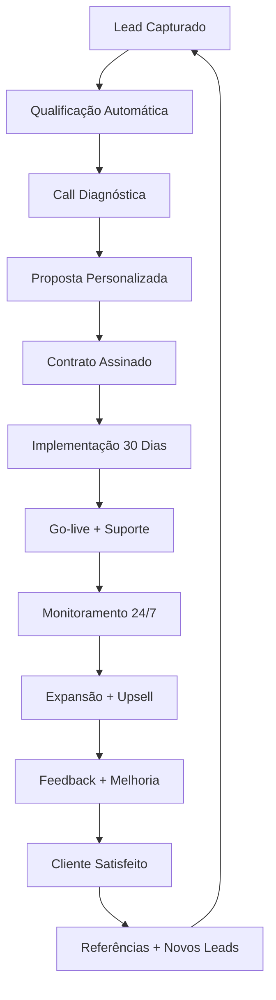

# 🔄 CICLO DE VIDA END-TO-END - PROJETO GRAVENTUM

**Data:** 14 de fevereiro de 2026  
**Status:** Estrutura operacional definitiva  
**Objetivo:** Visão macro completa de todos os processos, do primeiro contato à entrega final

---

## 🎯 **VISÃO GERAL DO CICLO**

```
LEAD → QUALIFICAÇÃO → DIAGNÓSTICO → PROPOSTA → IMPLEMENTAÇÃO → OPERAÇÃO → EXPANSÃO
```

---

## 📋 **ETAPA 1: CAPTAÇÃO DE LEADS (0-7 dias)**

### **1.1 Fontes de Leads**
- **Brave Lead Hunter** (automático, 4x/dia)
- **Social Signal Monitor** (automático, 6x/dia)
- **LinkedIn Prospecting** (manual/automático)
- **Referências** (clientes existentes)
- **Website/SEO** (formulários)

### **1.2 Critérios de Qualificação Automática**
```yaml
score_minimo: 6
nichos_prioritarios: [contabilidade, imobiliárias, clínicas, turismo]
tamanho_empresa: [pequena, média]
orçamento_minimo: R$ 1.000/mês
dores_identificadas: [processos_manuais, sistemas_lentos, integração]
```

### **1.3 Armazenamento Automático**
- **Supabase:** Tabela `leads` com todos os dados
- **n8n Workflow:** Qualificação automática
- **Dashboard:** Visualização em tempo real

### **1.4 Métricas da Etapa**
- Taxa de conversão: 5-10%
- Custo por lead: R$ 0 (automatizado)
- Tempo médio: 2-4 horas por lead

---

## 🎯 **ETAPA 2: QUALIFICAÇÃO E DIAGNÓSTICO (1-3 dias)**

### **2.1 Processo de Qualificação**
```
Lead qualificado → Agendamento call → Análise prévia → Call diagnóstica → Mapeamento processos
```

### **2.2 Checklist de Diagnóstico**
- [ ] **Processos atuais:** Mapeamento completo
- [ ] **Dores específicas:** Lista priorizada
- [ ] **Sistemas existentes:** Integrações necessárias
- [ ] **Time envolvido:** Stakeholders chave
- [ ] **Orçamento disponível:** Faixa confirmada
- [ ] **Timeline esperada:** Prazos realistas

### **2.3 Ferramentas de Diagnóstico**
- **Questionário automatizado** (Google Forms + n8n)
- **Análise de sistemas** (APIs, integrações)
- **Mapeamento de processos** (diagramas)
- **Calculadora de ROI** (estimativa de ganhos)

### **2.4 Saída da Etapa**
- **Documento de Diagnóstico** (PDF personalizado)
- **ROI Estimado** (ganhos mensuráveis)
- **Proposta Preliminar** (escopo + preço)

---

## 📝 **ETAPA 3: PROPOSTA E CONTRATAÇÃO (1-2 dias)**

### **3.1 Estrutura da Proposta**
```markdown
# PROPOSTA GRAVENTUM

## 1. DIAGNÓSTICO RESUMIDO
- Dores identificadas
- Processos mapeados
- Oportunidades de automação

## 2. SOLUÇÃO PROPOSTA
- Escopo detalhado
- Tecnologias utilizadas
- Integrações necessárias

## 3. TIMELINE DE IMPLEMENTAÇÃO
- Fase 1: Setup (dias 1-5)
- Fase 2: Desenvolvimento (dias 6-20)
- Fase 3: Testes (dias 21-25)
- Fase 4: Go-live (dia 26-30)

## 4. INVESTIMENTO
- Implementação: R$ X (único)
- Mensalidade: R$ Y/mês
- ROI estimado: Z meses

## 5. PRÓXIMOS PASSOS
- Assinatura contrato
- Kickoff meeting
- Início implementação
```

### **3.2 Contrato Padrão**
- **Escopo definido**
- **Prazos claros**
- **Garantias**
- **Suporte incluído**
- **Termos de cancelamento**

### **3.3 Processo de Assinatura**
- **DocuSign** ou similar
- **Pagamento inicial** (50%)
- **Kickoff agendado**

---

## 🛠️ **ETAPA 4: IMPLEMENTAÇÃO (15-30 dias)**

### **4.1 Fases da Implementação**

#### **FASE 1: SETUP (dias 1-5)**
- [ ] **Ambiente de desenvolvimento** configurado
- [ ] **Acesso a sistemas** do cliente
- [ ] **Reunião de kickoff** com stakeholders
- [ ] **Cronograma detalhado** aprovado
- [ ] **Comunicação estabelecida** (Slack/WhatsApp)

#### **FASE 2: DESENVOLVIMENTO (dias 6-20)**
- [ ] **Workflows principais** desenvolvidos
- [ ] **Integrações configuradas**
- [ ] **Testes unitários** realizados
- [ ] **Documentação técnica** criada
- [ ] **Treinamento inicial** da equipe

#### **FASE 3: TESTES (dias 21-25)**
- [ ] **Testes de integração** completos
- [ ] **Validação com usuários** finais
- [ ] **Ajustes finais** realizados
- [ ] **Performance otimizada**
- [ ] **Segurança validada**

#### **FASE 4: GO-LIVE (dias 26-30)**
- [ ] **Migração de dados** concluída
- [ ] **Sistema em produção**
- [ ] **Monitoramento ativado**
- [ ] **Suporte 24/7 habilitado**
- [ ] **Documentação final entregue**

### **4.2 Ferramentas de Implementação**
- **n8n:** Workflows principais
- **Supabase:** Banco de dados
- **Evolution API:** WhatsApp automation
- **Microsoft Graph:** Email/calendar
- **Google APIs:** Drive/Sheets/Calendar

### **4.3 Métricas da Implementação**
- **Tempo médio:** 22 dias
- **Taxa de sucesso:** 95%+
- **Satisfação cliente:** 9/10
- **ROI inicial:** 30-60 dias

---

## 🔄 **ETAPA 5: OPERAÇÃO E SUPORTE (contínuo)**

### **5.1 Monitoramento 24/7**
```yaml
monitoramento:
  uptime: 99.9%
  performance: alertas automáticos
  erros: notificação imediata
  backups: diários automáticos
```

### **5.2 Suporte Níveis**
- **Nível 1:** Autoatendimento (documentação, FAQs)
- **Nível 2:** Suporte técnico (email, WhatsApp)
- **Nível 3:** Desenvolvimento (ajustes, novas features)

### **5.3 SLA (Service Level Agreement)**
- **Resposta:** 2 horas úteis
- **Resolução:** 24 horas (crítico), 72 horas (normal)
- **Uptime:** 99.5% garantido
- **Backups:** Diários automáticos

### **5.4 Manutenção Proativa**
- **Updates mensais** (segurança, performance)
- **Otimizações trimestrais**
- **Relatórios mensais** de performance
- **Revisões semestrais** de estratégia

---

## 📈 **ETAPA 6: EXPANSÃO E UPSELL (contínuo)**

### **6.1 Oportunidades de Expansão**
- **Novos módulos** (funcionalidades adicionais)
- **Integrações extras** (sistemas complementares)
- **Treinamento avançado** (equipe expandida)
- **Consultoria estratégica** (otimização processos)

### **6.2 Processo de Upsell**
```
Monitoramento uso → Identificação oportunidades → Proposta valor → Implementação → Medição resultados
```

### **6.3 Métricas de Expansão**
- **Taxa de upsell:** 30% após 6 meses
- **LTV (Lifetime Value):** 18-24 meses
- **NPS (Net Promoter Score):** 60+ (excelente)
- **Referências:** 2-3 por cliente satisfeito

---

## 📊 **ETAPA 7: GOVERNANÇA E MELHORIA CONTÍNUA**

### **7.1 Revisões Regulares**
- **Weekly:** Status projetos ativos
- **Monthly:** Performance clientes
- **Quarterly:** Estratégia e melhorias
- **Annual:** Planejamento anual

### **7.2 Coleta de Feedback**
- **Pós-implementação:** Survey 30 dias
- **Trimestral:** NPS + feedback detalhado
- **Anual:** Revisão estratégica completa

### **7.3 Melhoria Contínua**
- **Processos:** Otimização constante
- **Tecnologia:** Updates regulares
- **Documentação:** Revisão contínua
- **Treinamento:** Capacitação da equipe

---

## 🎯 **VISÃO MACRO: FLUXO COMPLETO**



---

## 📁 **DOCUMENTAÇÃO E ATIVOS**

### **Documentos Padrão**
1. `template-proposta.md` - Proposta personalizável
2. `template-contrato.md` - Contrato padrão
3. `checklist-implementacao.md` - Checklist completo
4. `sla-padrao.md` - SLA de serviço
5. `template-treinamento.md` - Material de treinamento

### **Ferramentas Automatizadas**
1. **Qualificador de Leads** (n8n workflow)
2. **Gerador de Propostas** (template + dados)
3. **Monitor de Implementação** (dashboard)
4. **Sistema de Suporte** (ticketing)
5. **Relatórios Automáticos** (performance)

### **Dashboards de Gestão**
1. **Pipeline de Vendas** (leads → contratos)
2. **Status Implementação** (projetos ativos)
3. **Performance Clientes** (uptime, satisfação)
4. **Métricas Financeiras** (receita, LTV, CAC)
5. **Capacidade Operacional** (recursos, backlog)

---

## 🚀 **PRÓXIMOS PASSOS IMEDIATOS**

### **1. Implementar Sistema de Qualificação (48h)**
- [ ] Configurar n8n workflow de qualificação
- [ ] Integrar com Supabase leads
- [ ] Criar dashboard de pipeline

### **2. Desenvolver Templates Padrão (72h)**
- [ ] Template de proposta personalizável
- [ ] Contrato padrão revisado
- [ ] Checklist de implementação

### **3. Criar Dashboard de Gestão (96h)**
- [ ] Pipeline visual de vendas
- [ ] Status projetos ativos
- [ ] Métricas de performance

### **4. Automatizar Processos (7 dias)**
- [ ] Qualificação automática de leads
- [ ] Geração automática de propostas
- [ ] Monitoramento automático de projetos

---

## 💡 **PRINCÍPIOS OPERACIONAIS**

### **1. Transparência Total**
- Cliente vê tudo em tempo real
- Status atualizado automaticamente
- Comunicação proativa

### **2. Automação Máxima**
- Processos repetitivos automatizados
- Documentação gerada automaticamente
- Relatórios automáticos

### **3. Escalabilidade**
- Processos replicáveis
- Templates reutilizáveis
- Sistemas modulares

### **4. Qualidade Garantida**
- Checklists para tudo
- Validações em cada etapa
- Revisões de qualidade

### **5. Melhoria Contínua**
- Feedback incorporado
- Processos otimizados
- Inovação constante

---

**Status:** ✅ Estrutura definida  
**Próxima ação:** Implementar sistema de qualificação automática  
**Prazo:** Iniciar agora, concluir em 48h