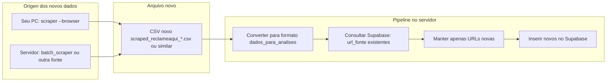

# Plano: Busca por novos dados

## Objetivo

Permitir que **novos dados** de reclamações/dores entrem no sistema sem duplicar o que já existe: buscar (scraping ou CSV novo), deduplicar por `url_fonte` e inserir só o que ainda não está no Supabase.

## Situação atual

- **Fonte ao vivo Reclame Aqui:** tools/reclameaqui_scraper.py com `--browser` funciona no **seu PC** (IP residencial); no servidor o site retorna 403.
- **Carga atual:** tools/carregar-dados-para-analises-supabase.py lê um CSV fixo, dedupe por `url_fonte` **dentro do arquivo**, e envia **todos** os registros para o Supabase. Não há consulta ao banco para evitar duplicar com o que já está lá.
- **Supabase:** Tabela dados_para_analises com `UNIQUE(url_fonte)`; inserir URL repetida gera erro.

## Fluxo desejado

## Implementação proposta

### 1. Script de carga incremental (só novos)

Criar um script (ex.: tools/carregar-novos-dados-supabase.py) que:

- **Entrada:** Caminho de um CSV de reclamações (formato scraped_reclameaqui_* ou compatível: url, niche, company, title, text, date, gravity).
- **Conversão:** Mapear para o formato da tabela dados_para_analises: nicho, sistema_software = company, empresa_reclamada = company, tipo_problema = primeiros termos do title ou vazio, descricao_problema = text, impacto_negocio = vazio ou fixo, data_reclamacao, url_fonte = url, gravidade.
- **Dedupe:** Chamar Supabase para obter a lista de url_fonte já existentes (GET com paginação se necessário). Filtrar as linhas do CSV cuja url_fonte não está nessa lista.
- **Carga:** Enviar apenas essas linhas novas via POST para dados_para_analises (em lotes), usando as credenciais do .env.

### 2. Onde os novos dados entram

- **Cenário A – Reclame Aqui no seu PC:** Rode no seu computador o scraper com --browser; isso gera um CSV. Copie para o servidor (ex.: outputs/datasets/) e no servidor rode o script de carga incremental passando esse arquivo.
- **Cenário B – Outras fontes no servidor:** batch_scraper.py ou research_scraper.py geram conteúdo; se o CSV tiver coluna url ou url_fonte no formato esperado, o mesmo script de carga incremental pode ser usado.

### 3. Documentação e uso pelo Helix

- Doc: Atualizar docs/SCRAPING_PESQUISA_CONTEXTO.md com os 3 passos: (1) Gerar CSV novo; (2) Copiar para o workspace se vier do PC; (3) Rodar carregar-novos-dados-supabase.py com o caminho do CSV.
- Prompt para o Helix: "Quando eu colocar um CSV novo de reclamações em outputs/datasets/ (ex.: scraped_reclameaqui_*.csv), roda o script de carga incremental para enviar só os registros novos para a tabela dados_para_analises no Supabase."

### 4. Resumo de arquivos

| Ação        | Arquivo / lugar |
| ----------- | --------------- |
| Novo script | tools/carregar-novos-dados-supabase.py |
| Doc         | docs/SCRAPING_PESQUISA_CONTEXTO.md ou outputs/datasets/DADOS_PARA_ANALISES_README.md: seção "Busca por novos dados" |
| Sem mudança | reclameaqui_scraper.py, dados_para_analises_table.sql; opcional: carregar-dados-para-analises-supabase.py continua para carga em massa |

Assim, a "busca por novos dados" fica clara: novos dados vêm do scraper (ou de outro CSV); um único script no servidor garante que só entram registros com url_fonte ainda inexistente no Supabase.
